# MedSpot

A full-stack healthcare platform connecting patients with nearby pharmacies to check real-time medicine availability and reserve prescriptions.
   
## Overview

MedSpot is organized as a monorepo containing multiple client applications backed by shared services — a pharmacy web portal, an admin portal, a patient-facing mobile app, and a point-of-sale system, all connecting to a common backend and a dedicated OCR service for reading prescriptions.

## Project Structure

```
medspot/
├── apps/
│   ├── admin_portal/          # Admin dashboard (React)
│   ├── mobile_app/            # Patient-facing mobile app (Flutter)
│   ├── pharmacy_pos/          # Point-of-sale system for pharmacies
│   └── pharmacy_web_portal/   # Pharmacy staff web portal (React)
└── services/
    ├── medspot_service/       # Main backend API (Node.js/Express, PostgreSQL)
    ├── ocr_service/           # Prescription OCR pipeline (Python, EasyOCR)
    └── pos_service/           # POS backend
```

## Tech Stack

React.js, Node.js, Express.js, PostgreSQL, Flutter, Python (FastAPI), EasyOCR, Socket.io

## Key Features

- Real-time medicine availability search across nearby pharmacies
- OCR pipeline that extracts medicine names and dosage from uploaded prescription images
- Role-based JWT authentication for patients and pharmacy staff
- Real-time reservation notifications via Socket.io
- Admin portal for platform-wide management
- Integrated point-of-sale system for in-pharmacy transactions

## Screenshots

### Mobile Application

| Login Page | Home Page |
|---|---|
| 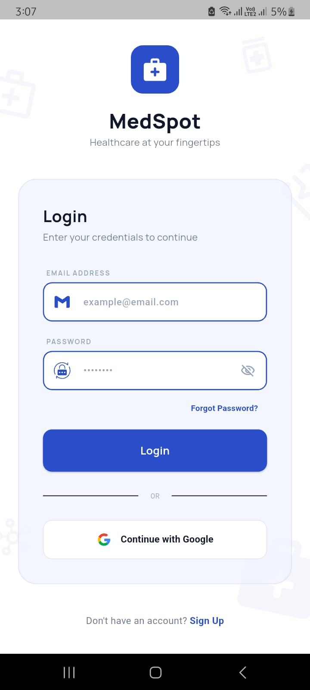 | 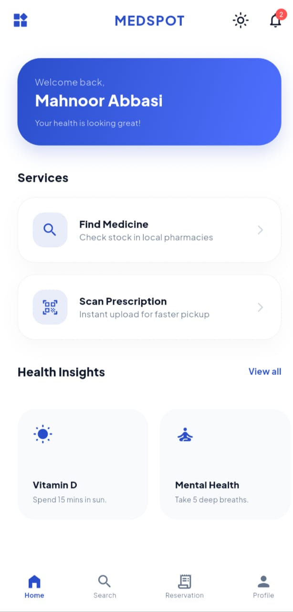 |

| Prescription Page | Result Page |
|---|---|
| 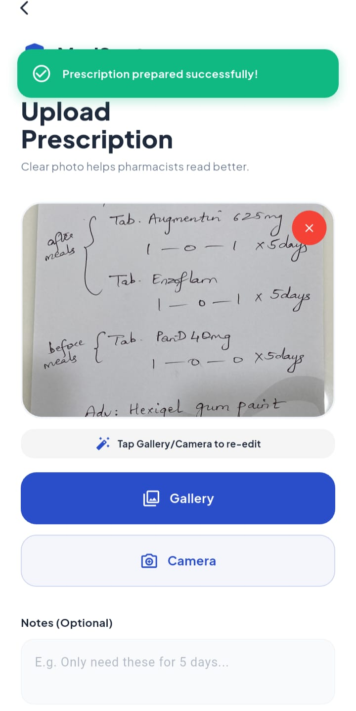 | 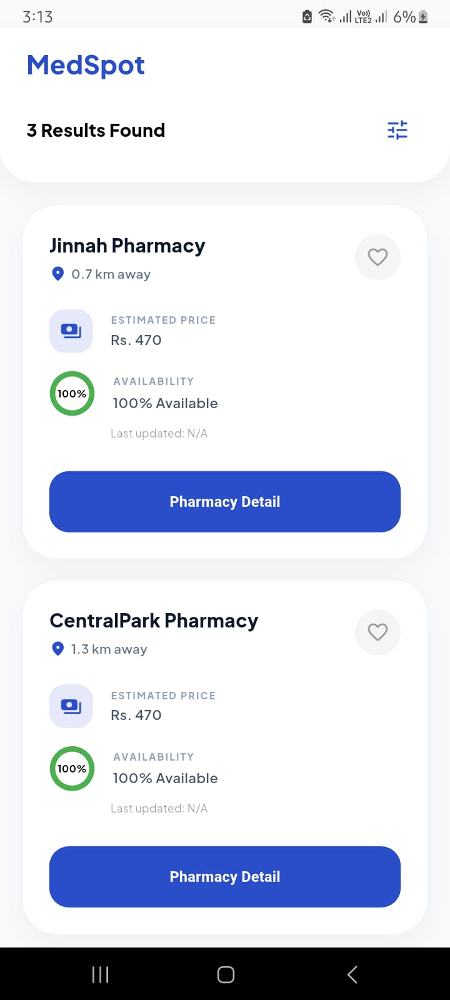 |

### Pharmacy Web Portal

| Dashboard | Prescription Management |
|---|---|
| 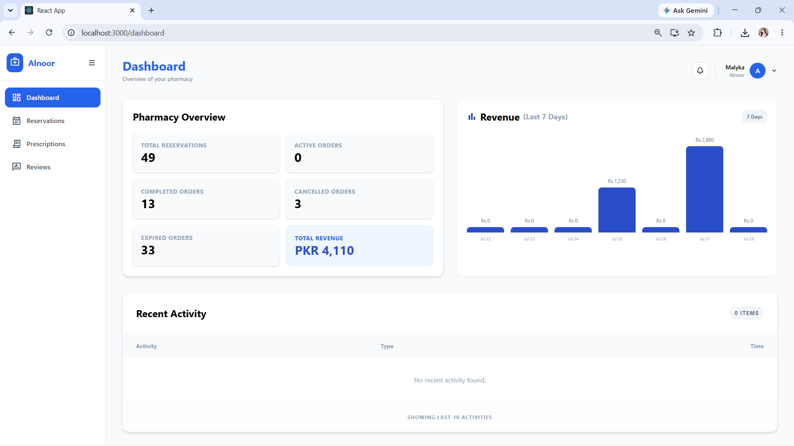 | 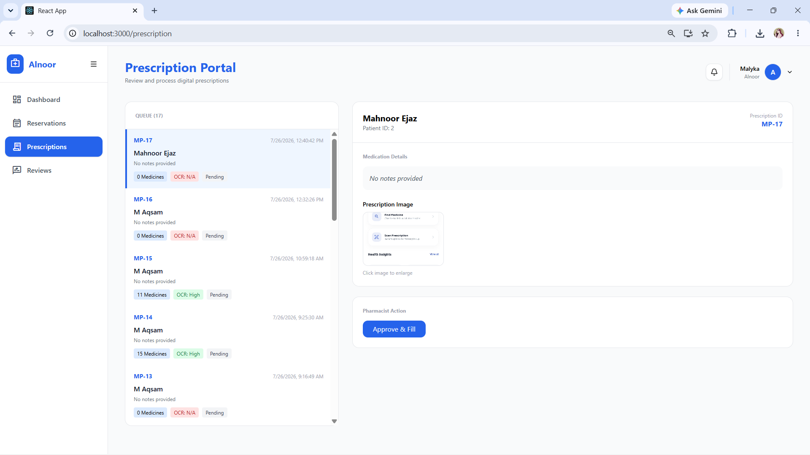 |

| Reservation Management | POS Integration |
|---|---|
| 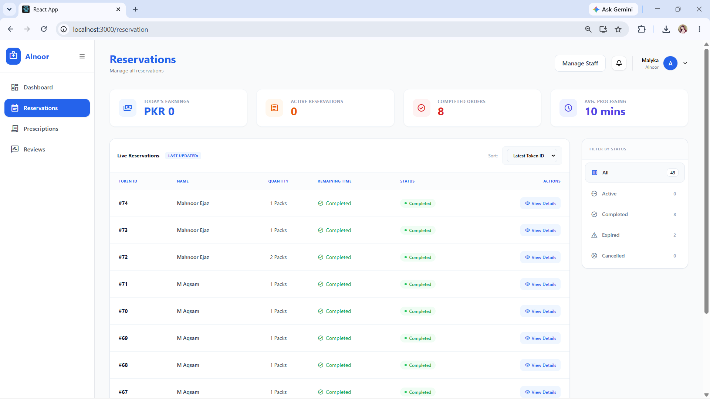 | 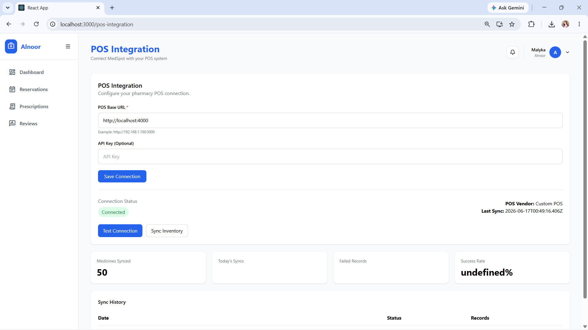 |

### Admin Portal

| Admin Dashboard | Pharmacy Verification |
|---|---|
| 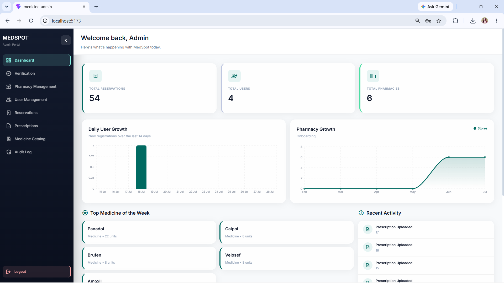 | 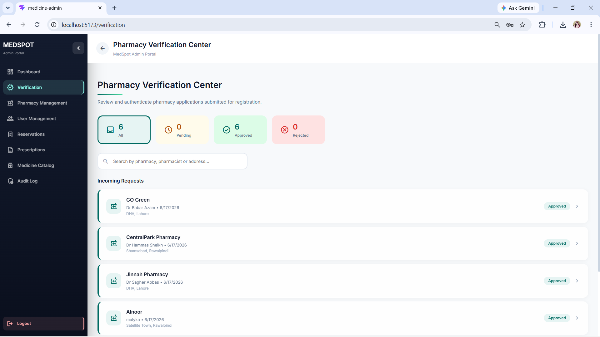 |

| Prescription Management | Reservation Management |
|---|---|
| 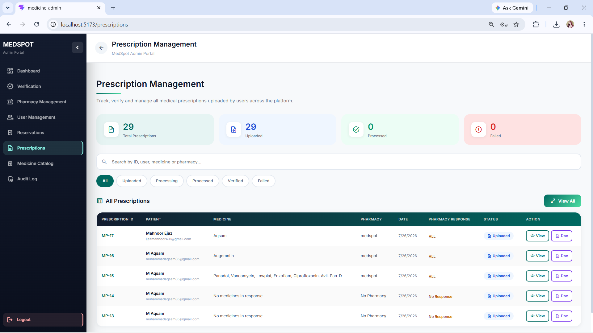 | 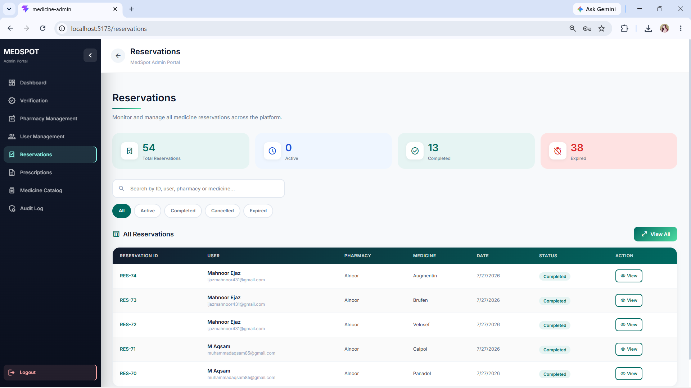 |


## Contributors

| Name | Role | GitHub |
|---|---|---|
| [Aqsam Shahid] | Team Lead · Backend (medspot_service) · OCR service integration .Pharmacy Web Portal | [@yourusername](https://github.com/yourusername) |
| [Mahnoor ijaz] | Mobile App (Flutter) | [@username](https://github.com/username) |
| [Malayka Mir]  | Admin Web Portal (React) | [@username](https://github.com/username) |


## Modules

- Patient mobile application (Flutter)
- Pharmacy web portal (React)
- Admin portal (React)
- Pharmacy POS
- Main backend API (Node.js/Express)
- OCR prescription service (Python/FastAPI)

## Running Locally

Each app/service has its own dependencies and environment variables. Copy `.env.example` to `.env` in each service folder and fill in your own values before running.

**Pharmacy web portal** (`apps/pharmacy_web_portal`) — Create React App
```
cd apps/pharmacy_web_portal
npm install
npm start
```

**POS frontend** (`apps/pharmacy_pos`) — Create React App
```
cd apps/pharmacy_pos
npm install
npm start
```
> Note: both the pharmacy web portal and POS frontend run on port 3000 by default (CRA default). If you run them at the same time, CRA will prompt you to switch to another port (e.g. 3001) — accept the prompt, or set a custom port with `PORT=3001 npm start`.

**Backend API** (`services/medspot_service`)
```
cd services/medspot_service
npm install
npm run dev
```

**Admin portal** (`apps/admin_portal`)
```
cd apps/admin_portal
npm install
npm run dev
```

**OCR service** (`services/ocr_service`) — Python/FastAPI
```
cd services/ocr_service
python -m venv venv
./venv/Scripts/activate      # on Windows
# source venv/bin/activate   # on macOS/Linux
pip install -r requirements.txt
uvicorn app:app --reload
```

**Mobile app** (`apps/mobile_app`) — Flutter
```
cd apps/mobile_app
flutter pub get
flutter run
```

## API Documentation

MedSpot provides two API services with interactive Swagger documentation.

### MedSpot Backend API

The main backend manages authentication, patients, pharmacies, prescriptions, reservations, staff, notifications, inventory, POS sales, and administration.

After starting the backend service, open Swagger UI:

- [Open MedSpot Backend API Documentation](http://localhost:5000/api-docs)

### OCR Service API

The OCR service processes uploaded prescription images and extracts medicine information, including medicine name, dosage, frequency, and confidence.

After starting the OCR service, open Swagger UI:

- [Open OCR Service API Documentation](http://localhost:8000/docs)

> These documentation links work locally while their respective services are running.

## About this project

Built as a hands-on full-stack project to explore real-world healthcare application development — including OCR integration, real-time systems, role-based access control, and coordinating multiple client applications around a shared backend.
